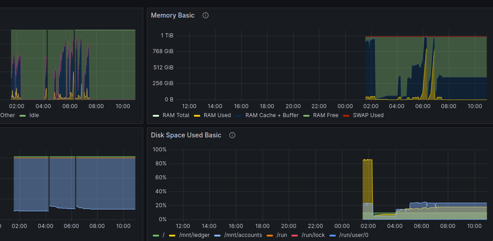

simple grafana /porom / node_exporter stack actually working out of the box in 2024 (seem hard to find)

just
    
    mkdir data
    sudo chown -R nobody:nogroup data
    docker-compose up -d

prom is
http://prometheus:9090

go to http://localhost:3000
admin/admin

change the pass

node_exporter
1860

process_exporter
8378
249

enjoy

